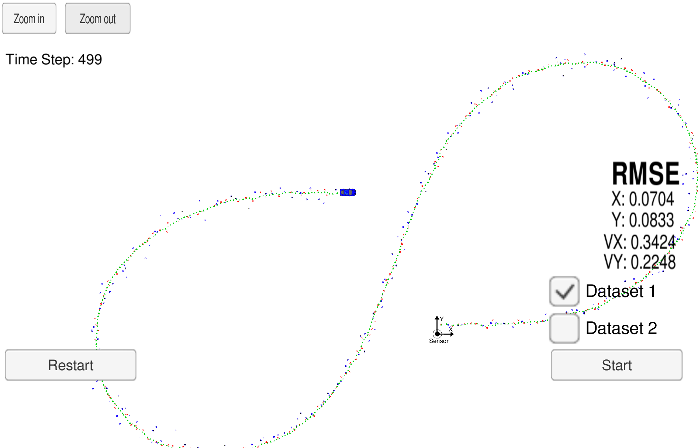
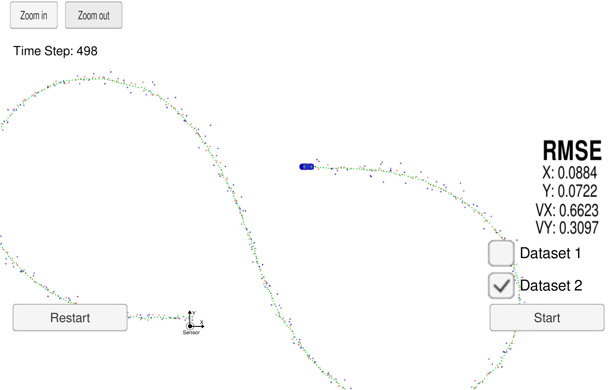

### **无迹卡尔曼滤波Unscented Kalman Filter**

**Goal**

使用无迹卡尔曼滤波方法，基于Ladar与Radar的测量数据估计小车的运动状态

**Usage**

进入目标文件夹，在命令行输入以下命令

```shell
mkdir build && cd build
cmake .. && make
./UnscentedKF
```

打开模拟器，进入1/2 project 选择dataset 1/2 并运行，结果如下：


Dataset 1:



Dataset 2:




**Prerequisites**

* cmake &ge; 3.5 
* make &ge; 4.1 (Linux, Mac), 3.8 (Windows 10, 不推荐)
* gcc/g++ &ge; 5.4 （Windows MinGW)
* uWebSocketIO from [here](https://github.com/uNetworking/uWebSockets)
* *simulator* from [here](https://github.com/udacity/self-driving-car-sim/releases/)


